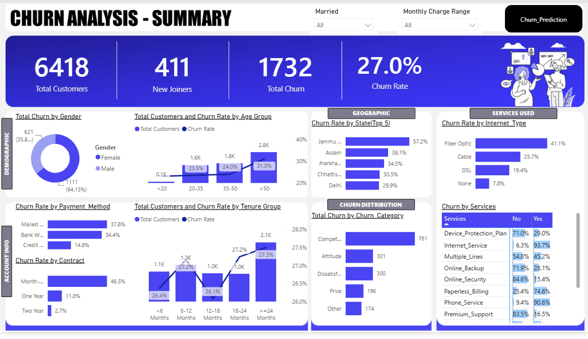
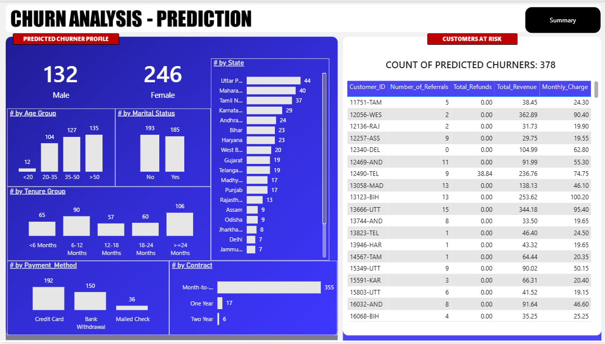

# 📊 End-to-End Customer Churn Analysis & Prediction

An end-to-end Data Analytics project that analyses telecom customer churn using **Python**, **SQL Server**, **Machine Learning**, and **Power BI**. The project focuses on identifying churn patterns, predicting customers at risk, and providing business insights to improve customer retention.


---

# 📌 Project Overview

Customer churn is one of the biggest challenges faced by subscription-based businesses. This project analyses customer behaviour, identifies factors contributing to churn, predicts customers likely to leave using machine learning, and presents actionable business insights through interactive Power BI dashboards.
---

# 🎯 Business Problem

Customer retention is one of the biggest challenges in the telecom industry. Acquiring a new customer is significantly more expensive than retaining an existing one. Therefore, businesses need to identify customers who are likely to churn and understand the factors influencing their decisions.

The objective of this project is to:

- Analyze customer demographics and subscription behaviour.
- Identify key factors contributing to customer churn.
- Predict customers at high risk of leaving using Machine Learning.
- Build an interactive Power BI dashboard to help business stakeholders make data-driven decisions.

---

# ⚙️ Project Workflow

```
Customer Dataset
        │
        ▼
Data Cleaning & Preprocessing (Python)
        │
        ▼
Exploratory Data Analysis (Python)
        │
        ▼
Business Analysis (SQL Server)
        │
        ▼
Machine Learning Model
(Random Forest)
        │
        ▼
Prediction Dataset
        │
        ▼
Power BI Dashboard
        │
        ▼
Business Insights
```

---

# 🛠️ Technology Stack

| Category | Technologies |
|----------|--------------|
| Programming | Python |
| Data Analysis | Pandas, NumPy |
| Database | SQL Server |
| Visualization | Power BI |
| Data Transformation | Power Query |
| DAX | Measures & KPIs |
| Machine Learning | Scikit Learn (Random Forest) |
| IDE | Jupyter Notebook |
| Version Control | Git & GitHub |

---

# 📊 Power BI Dashboard

## 1. Executive Summary Dashboard

Provides an overview of customer churn metrics, customer demographics, service usage, churn distribution, customer segments, and key performance indicators.



---

## 2. Customer Churn Prediction Dashboard

Displays customers predicted to churn using machine learning models, enabling businesses to proactively identify high-risk customers and support customer retention strategies.



---

# 🤖 Machine Learning Models

The project includes predictive modelling to identify customers who are likely to churn.

Models implemented:

- Random Forest Classifier

The models were trained after performing:

- Data Cleaning
- Feature Engineering
- Label Encoding
- Train-Test Split
- Model Evaluation

---

# 💡 Key Business Insights

- The overall customer churn rate is **27%**, indicating a significant opportunity for customer retention initiatives.
- Customers with **Month-to-Month contracts** exhibited substantially higher churn compared to long-term contract customers.
- **Fiber Optic Internet** customers experienced a higher churn rate than DSL users.
- Customers with **shorter tenure** were more likely to discontinue their services.
- The machine learning model identified customers at high risk of churn, enabling businesses to implement targeted retention strategies.

---

# 📂 Repository Structure

```
Customer-Churn-Analysis-Prediction
│
├── 01_Dataset
│   ├── Prediction_Data.xlsx
│   ├── Predictions.xlsx
│
├── 02_Python_Notebook
│   └── Python Code.pdf
│
├── 03_SQL_Queries
│   └── SQL Queries
│
├── 04_PowerBI_Dashboard
│   └── Customer_Churn_Analysis_Dashboard.pbix
│
├── 05_Dashboard_Screenshots
│   ├── Summary.png
│   └── Churn_Prediction.png
│
└── README.md
```

# 📈 Project Outcomes

- Analysed over 7,000 telecom customer records.
- Built an end-to-end analytics pipeline using Python, SQL Server, Machine Learning, and Power BI.
- Developed interactive dashboards to monitor churn metrics and customer behaviour.
- Built predictive models to identify customers likely to churn and support business decision-making.

---

# 🚀 Future Enhancements

- Deploy the prediction model as a web application.
- Automate data refresh for real-time churn monitoring.
- Experiment with advanced models such as XGBoost and LightGBM.
- Integrate customer feedback and sentiment analysis into churn prediction.

---

# 👨‍💻 Author

**Metuku Eswar Chandra**

B.Tech – Electronics & Communication Engineering

National Institute of Technology Raipur

GitHub: https://github.com/MetukuEswarChandra
